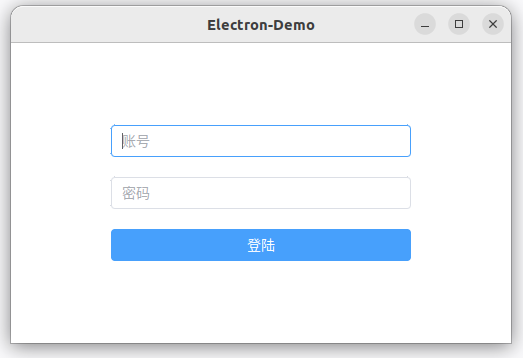
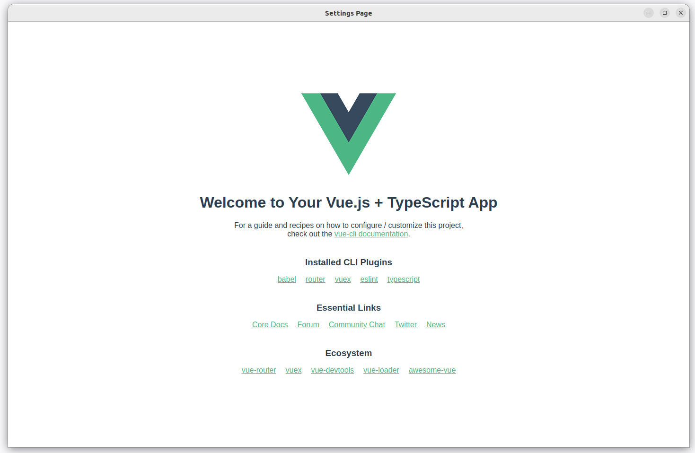

# electron-demo
electron + vue3 + webpack5 + typescript 

### 运行效果图
运行软件后，打开的界面是登陆界面，用户名密码是: admin / 123456  
  

登陆成功后，会进入到Vue的模板页面(这里利用了vue-router特性).  
  

### 快速体验

1. 拉项目代码  
git clone https://github.com/zhengtong0898/electron-demo.git  

2. 进入代码目录  
cd electron-demo/  

3. 安装yarn  
sudo npm install --global yarn  

4. 安装依赖  
yarn install  

5. 运行项目代码  
yarn start  

### 调试项目技巧
1. 单独打包vue代码: yarn makevue  

2. 运行整个项目: yarn start  

3. 打包整个项目: yarn make  

4. 直接运行`.js`代码: node filename.js

4. 直接运行`.ts`代码: npx ts-node filename.ts

4. VSCode 按 F5 快捷键, 可进入调试模式.  

5. 软件运行时, 按 Ctrl + R 是刷新页面.  

6. 软件运行时, 按 Ctrl + Shift + R 是强制刷新页面.  

7. 软件运行时, 按 Ctrl + Shift + I 是打开调试面板.  

### 参考资料  

1. [webpack 打包 vue 最简 最新](https://www.bilibili.com/video/BV1WU4y1c7oW)  

2. [快速创建一个 electron-app](https://www.electronforge.io/#creating-a-new-app)   

3. [Electron官方文档](https://www.electronjs.org/docs/latest/tutorial/process-model)  

### 项目文件信息

1. electron 项目配置入口文件: forge.config.ts  

2. vue 项目配置入口文件: webpack.vue.config.ts  

3. webpack入口变量参考值  
   MAIN_WINDOW_PRELOAD_WEBPACK_ENTRY:  
   /home/electron-demo/out/resources/app/.webpack/renderer/main_window/preload.js  
   MAIN_WINDOW_WEBPACK_ENTRY:  
   file:///home/electron-demo/out/resources/app/.webpack/renderer/main_window/index.html  

4. webpack.vue.config.ts 中的 vue-loader 用来例将.vue后缀代码转换成js代码.  

5. webpack.vue.config.ts 中的 html-webpack-plugin 用来根据指定的模板文件渲染并生成入口index.html文件.  

6. webpack.vue.config.ts 中的 CopyWebpackPlugin 用来拷贝指定文件至 output 目录(即: dist/)  

7. public/index.html 是vue的渲染模板文件.  

8. public/electron.tsconfig.json 是编译electron时需要依赖的typescript描述文件.  

9. public/vue.tsconfig.json 是编译vue时需要依赖的typescript描述文件.    
