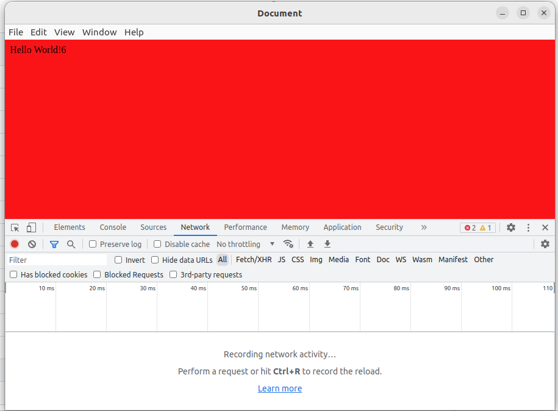

# electron-demo
electron + vue3 + webpack5 + typescript 

### 安装yarn
npm install --global yarn

### 创建项目
> refer: https://www.electronforge.io/#creating-a-new-app    

yarn create electron-app electron-demo --template=webpack-typescript    
cd electron-demo

### 安装依赖
yarn add vue vue-loader style-loader css-loader html-webpack-plugin webpack-cli copy-webpack-plugin --dev

### 单独打包vue
yarn makevue

### 编译打包(包含打包vue)
yarn make

### 运行项目(包含打包vue)
yarn start

### 调试项目
按 F5 快捷键

### 运行效果图

### 关键信息

1. electron 项目配置入口文件: forge.config.ts  
2. vue 项目配置入口文件: webpack.vue.config.ts  
3. webpack入口变量参考值  
   MAIN_WINDOW_PRELOAD_WEBPACK_ENTRY:  /home/electron-demo/out/resources/app/.webpack/renderer/main_window/preload.js  
   MAIN_WINDOW_WEBPACK_ENTRY:  file:///home/electron-demo/out/resources/app/.webpack/renderer/main_window/index.html  

4. webpack.vue.config.ts 中的 vue-loader 用来例将.vue后缀代码转换成js代码.  
5. webpack.vue.config.ts 中的 html-webpack-plugin 用来根据指定的模板文件渲染并生成入口index.html文件.  
6. webpack.vue.config.ts 中的 CopyWebpackPlugin 用来拷贝指定文件至 output 目录(即: dist/)  

7. public/index.html 是vue的渲染模板文件.  
8. public/electron.tsconfig.json 是编译electron时需要依赖的typescript描述文件.  
9. public/vue.tsconfig.json 是编译vue时需要依赖的typescript描述文件.    

